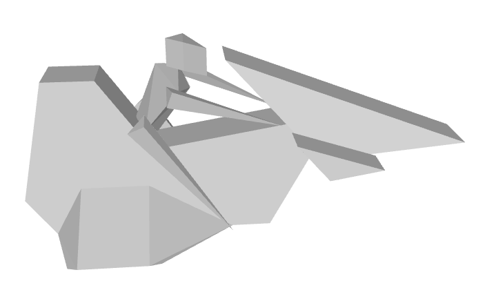

# SWAModelConvertor

Powershell 5 script to convert Syndicate Wars Pre-Alpha 3D Models to Wavefront .OBJ format. 

The pre-alpha rolling demo (and only this demo) of the game Syndicate Wars by Bullfrog Productions has an unused directory called "objects" in it that contain the game's 3D models in various formats. Files with the extension .Bxx are in some kind of simplistic custom format used internally by Bullfrog with the header "Bullfrog Standard 3D Object Format". It's very similar to the Wavefront .OBJ file format so I decided to make a convertor.

There are only 11 objects in this format, but a few are interesting to see:

## Usage

Run with SWAModelConvert.ps1  {filename}

e.g. SWAModelConvert.ps1 VEH02.B08

The script will generate the .obj file in the current directory.

It's possible other games used this format so may work there.

Note there is more information in the original Bullfrog format such as colours of faces etc, but I'm only converting the bare minimum just to see what these were.
